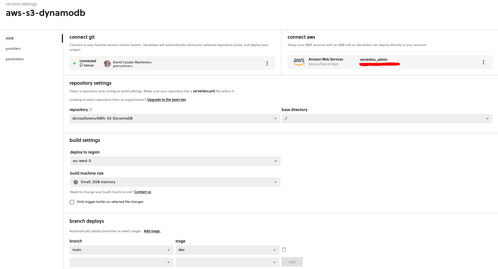

# AWS S3-LAMBDA-DYNAMODB

[First Steps](https://www.serverless.com/framework/docs/getting-started)

[Configurable credentials](https://www.serverless.com/framework/docs/providers/aws/guide/credentials#creating-aws-access-keys)

~~~~
serverless config credentials --provider aws --key <key> --secret <secret key>
~~~~

[Serverless S3 example](https://docs.aws.amazon.com/lambda/latest/dg/with-s3-example.html)

[Serverless DynamoDB example](https://www.serverless.com/examples/aws-node-express-dynamodb-api)

[Creating Role](https://serverlessfirst.com/create-iam-deployer-roles-serverless-app/)

These is the documentation that I follow for configure serverless with AWS.

After this, I configure ci/cd deploys with GitHub

## Demostration

I upload a image to a S3 you can see the Last Modified Date is ***April 30, 2022, 15:47:45 (UTC+02:00)*** this is the time on the time zone eu-west-3 but in DynamoDB appears the CreationDate in the UTC TIME ***2022-4-30 13:47:47***, this time zone is two hours less than eu-west-3.

